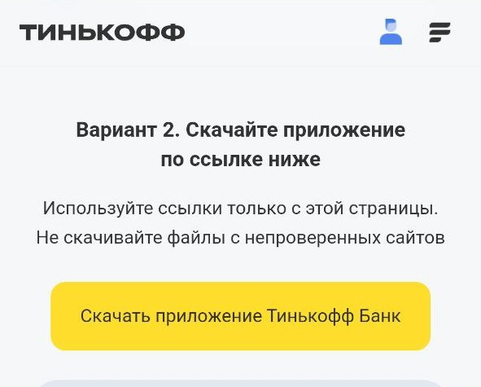
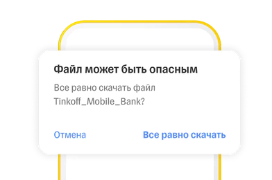
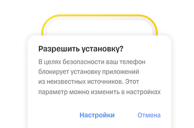
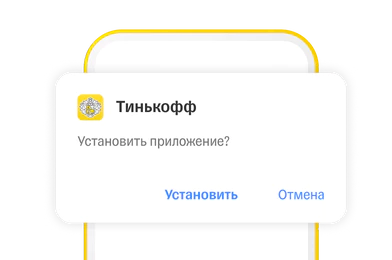

# Пользователям Android

## Вариант №1

1. Загрузите по QR-коду 

Или перейдите на [tinkoff.ru](https://tinkoff.ru/)  и нажмите на кнопку **Скачать приложение Тинькофф банк**

  
  

2. В случае уведомления «Файл может быть опасным» нажмите «Все равно скачать». Гарантируем безопасность файлов

  

2. Если смартфон запросит разрешение, дайте его в настройках: Разрешить из этого источника → Установить

  

3. После скачивания найдите файл в загрузках и начните установку: приложение появится на рабочем столе

  

___

## Вариант 2. Скачивайте нас в доступных магазинах приложений

#### Загрузите и установите приложение в любом из этих маркетов приложений.

##### [AppGallery](https://appgallery.huawei.com/#/app/C101291451) 
##### [RuStore](https://apps.rustore.ru/app/com.idamob.tinkoff.android) 
##### [Samsung Store](https://apps.samsung.com/appquery/appDetail.as?appId=com.idamob.tinkoff.android) 

___

## Вариант 3. Помощь представителя

Если у вас назначена доставка, поможет представитель

Он приедет с картой или другим продуктом и поможет получить доступ к личному кабинету

___

##### [На главную](readme.md)