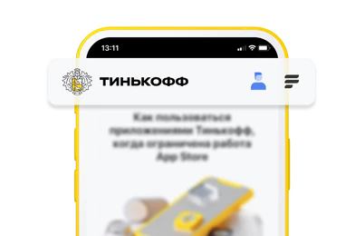
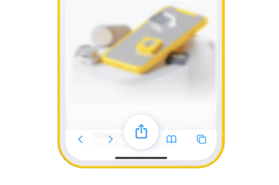
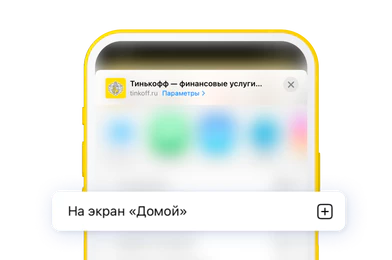
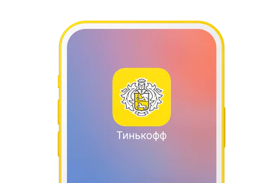
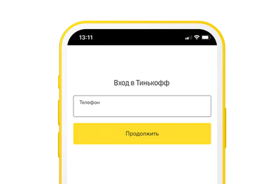
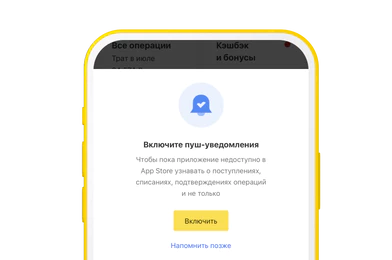
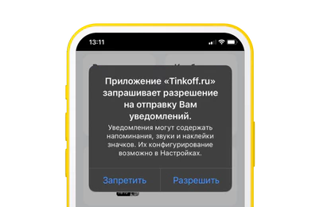
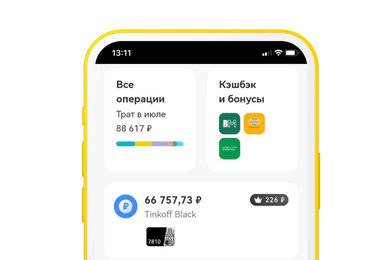

# Пользователям iOS

## Вариант №1
1. Откройте сайт [tinkoff.ru](https://tinkoff.ru/) на смартфоне в браузере **Safari**

  

2. Нажмите в нижнем меню браузера центральную иконку **«Поделиться»**

  

3. Выберите На экран **«Домой»**

  

4. **Иконка Тинькофф появится на рабочем столе.** Нажмите на нее, чтобы попасть в личный кабинет

  

5. **Войдите в личный кабинет**

  

6. Нажмите на кнопку **«Включить»**, чтобы вовремя узнавать о всех поступлениях и финансовых операциях

  

7. **Разрешите отправку уведомлений**
    Сразу после подтверждения будут приходить бесплатные уведомления. Уведомления работают с версии iOS 16.4 и выше

  

8. **Готово!** Вы можете управлять своими финансами как обычно

  

___

## Вариант 2
#### Новым клиентам

Если у вас назначена доставка, поможет представитель.
Он приедет с картой или другим продуктом и поможет получить доступ к приложению

#### Действующим клиентам

Для получения доступа к приложению необходимо обратиться в поддержку по телефону **8 800 700-66-66** (звонок бесплатный) или напишите в чат поддержки

##### [Ссылка на чат в личном кабинете ](https://www.tinkoff.ru/mybank/?openChat=bank&chatMessage=%D0%A5%D0%BE%D1%87%D1%83%20%D0%BD%D0%B0%D0%B7%D0%BD%D0%B0%D1%87%D0%B8%D1%82%D1%8C%20%D0%B2%D1%81%D1%82%D1%80%D0%B5%D1%87%D1%83%20%D0%B4%D0%BB%D1%8F%20%D1%83%D1%81%D1%82%D0%B0%D0%BD%D0%BE%D0%B2%D0%BA%D0%B8%20%D0%BF%D1%80%D0%B8%D0%BB%D0%BE%D0%B6%D0%B5%D0%BD%D0%B8%D1%8F&sendMessage)

___

##### [На главную](readme.md)

